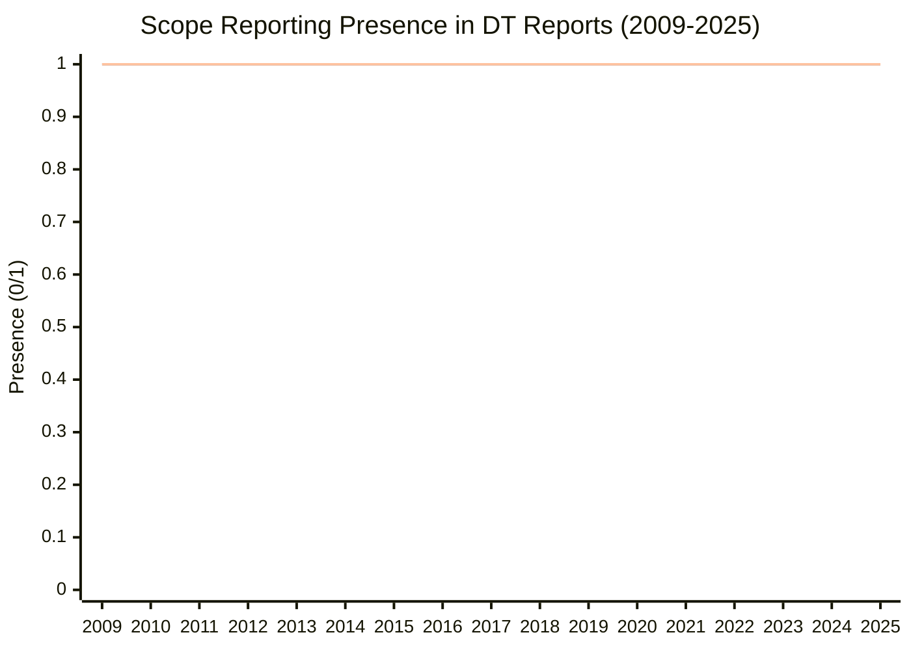
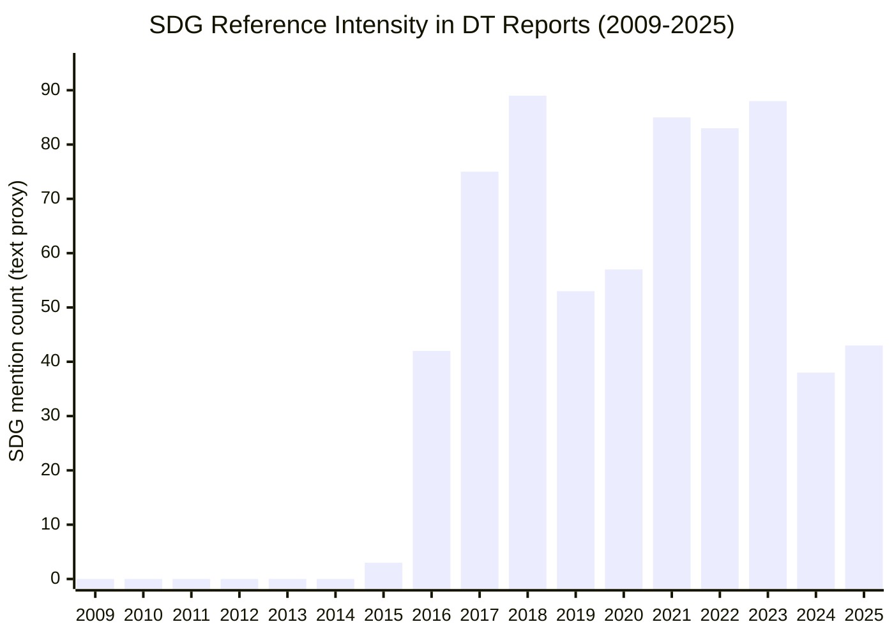
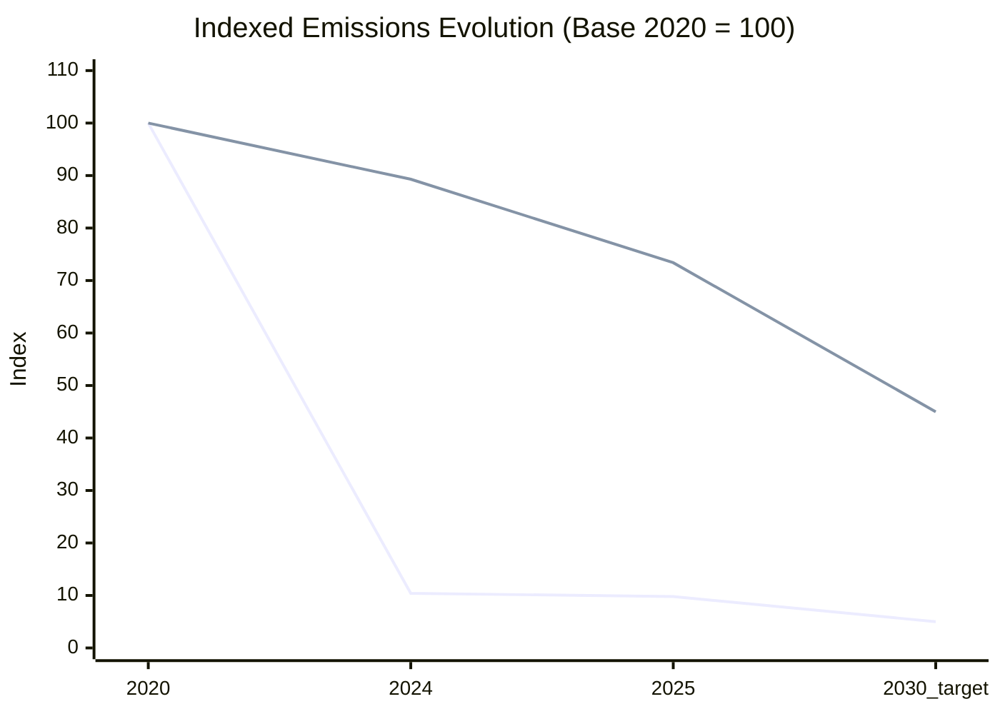
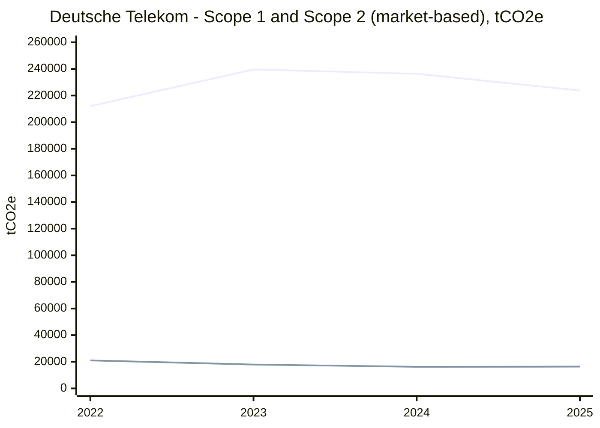
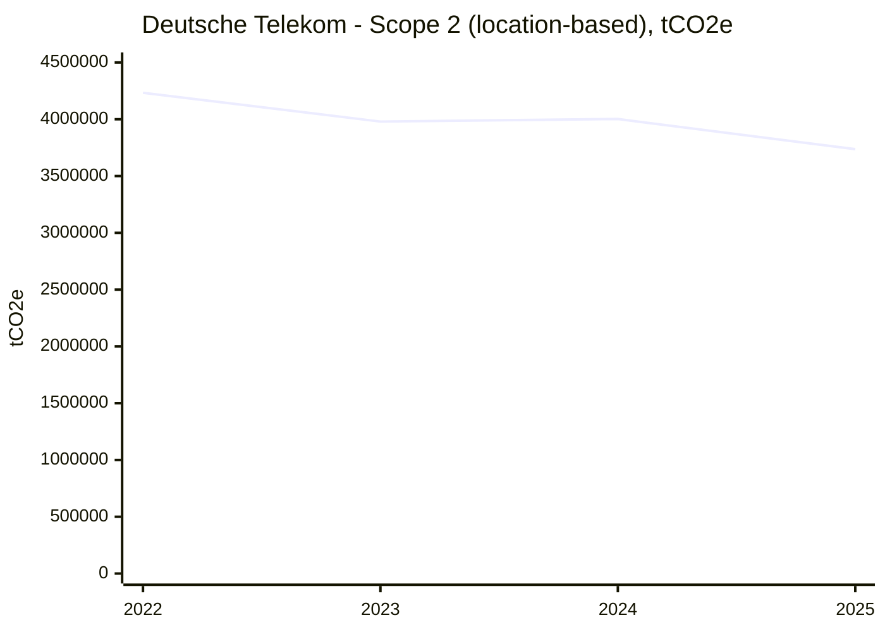
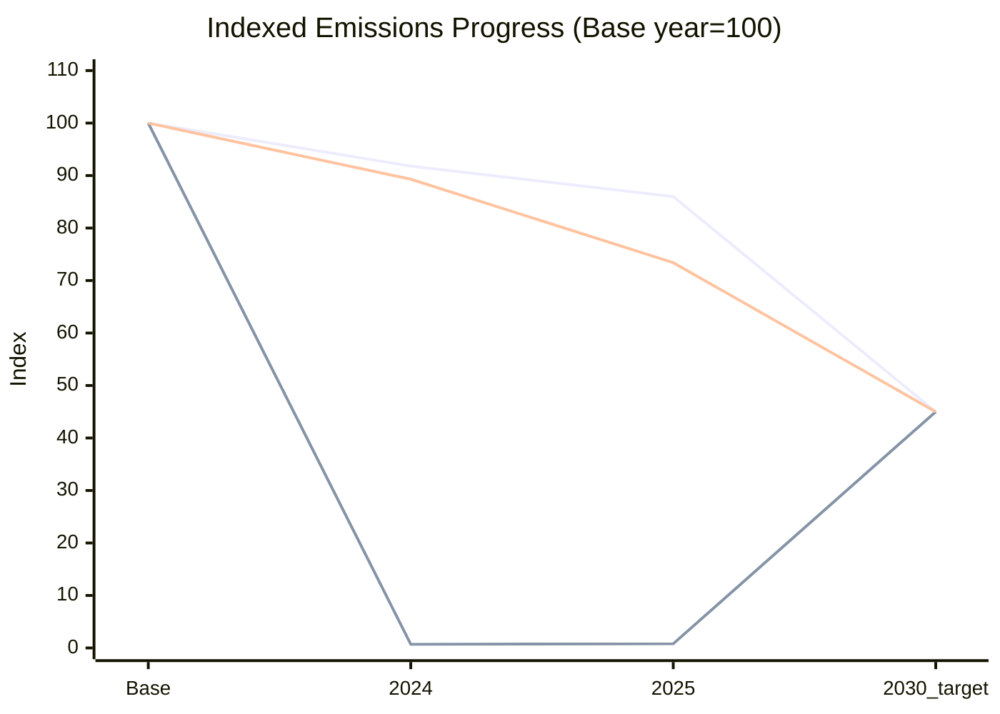

# Deutsche Telekom Sustainability Strategy Analysis (Syllabus-Aligned)

## Executive Summary
Deutsche Telekom (DT) has built one of the more advanced sustainability management systems in the telecom sector: board-level accountability, climate-linked incentives, ESRS-aligned reporting, and explicit transition milestones. The company reports net zero for own operations (Scope 1 and 2) in 2025 through deep reductions plus residual neutralization, while maintaining medium-term and long-term value-chain ambitions.

The strategic challenge is no longer reporting maturity. It is transformation speed and value capture, especially in Scope 3 (supply chain and product use phase), where most telecom emissions sit. The key assignment conclusion is that DT should now convert reporting strength into measurable competitive advantage (lower risk cost, stronger B2B win-rate, and more resilient long-term margins).

## 1) Company Context, Industry Dynamics, and Competitive Position

### 1.1 Business context
DT is a large, integrated telecom operator with high infrastructure intensity (networks, data centers, devices, IT operations), strong energy exposure, and broad B2C/B2B customer segments. This makes sustainability strategy directly tied to operating economics, not only reputation.

### 1.2 Industry and competitors
Relevant peers include Orange, Telefonica, and Vodafone in Europe, and US operators for technology and operating benchmarks. The sector faces simultaneous pressure on:
- decarbonization and energy efficiency,
- digital trust (cybersecurity, privacy, responsible AI/data use),
- supply chain transparency and human rights requirements,
- regulated disclosure quality and assurance readiness.

### 1.3 Structural trends from course and market
- Europe has moved into mandatory sustainability reporting (CSRD/ESRS), increasing transparency and management discipline.
- Stakeholders increasingly expect business-case ESG, not narrative ESG.
- Physical climate risk and transition risk are becoming financially material for telecom infrastructure.
- Scope 3 management (suppliers, devices, use phase) is now the decisive strategic frontier.

## 2) Current Strategy Assessment of Deutsche Telekom

### 2.1 What DT does well
1. Strong strategic integration
DT states that CR/ESG strategy is derived from business model and shapes strategic choices.

2. Governance and accountability
Board oversight is explicit; non-financial KPIs are integrated into management steering and compensation logic.

3. Reporting and materiality maturity
DT reports ESRS alignment and double-materiality process development under CSRD logic.

4. Ambition architecture is clear
- 2025: net zero in own operations (Scope 1 and 2)
- 2030: -55% Scope 1-3 vs 2020
- 2040: net zero value chain with at least 90% reduction vs 2020; max 10% neutralization

5. Multi-pillar strategy coherence
DT combines climate, circularity, digital society, inclusion, and governance into one management system.

### 2.2 Strategic risks and gaps
1. Scope 3 execution risk
The largest emissions and transition complexity are outside direct operations.

2. KPI quality risk
A large KPI set does not automatically create better decisions; KPI architecture must link hindsight, insight, and foresight.

3. Circularity economics risk
Device/network circularity ambitions are strong, but depend on ecosystem incentives and unit economics.

4. Regional execution risk
A single global governance model can underperform if local market and regulatory realities are not translated into local action plans.

## 3) Quantitative Evidence and Emissions Evolution (Scope 1, 2, 3)

### 3.0 Longitudinal evidence across all available reports (2009-2025)
You are right to ask for a full historical view. I therefore consolidated all CSR/CR reports available in this repository from 2009 to 2025 and tested year-by-year whether Scope 1, Scope 2, Scope 3 and SDG references are present.

Result:
- Scope 1 reporting signal: present in every report from 2009 to 2025.
- Scope 2 reporting signal: present in every report from 2009 to 2025.
- Scope 3 reporting signal: present in every report from 2009 to 2025 (depth increases strongly over time).
- SDG references: absent in older reports, then strongly present from 2015 onward.

#### Scope reporting continuity (binary presence by year)

Interpretation:
- The timeline shows continuity of scope vocabulary and disclosure references since 2009.
- The strategic evolution is therefore not "start vs no start" but "disclosure maturity and management integration over time".

#### SDG reporting evolution (mention count proxy)

Interpretation:
- 2009-2014: no meaningful SDG references in extracted text.
- 2015-2018: strong take-off (UN SDG agenda integration period).
- 2019-2025: sustained SDG integration, with fluctuations due to report structure, format, and extraction artifacts.

Method note:
- The SDG trend above is a text-mention proxy extracted automatically from your local PDF set. It captures disclosure intensity, not impact performance by SDG.
- For strict academic use, this should be complemented with manual coding of DT's "SDG contribution" tables per year.

### 3.0A Annual Scope table (2009-2025, tCO2e)
The table below adds the full timeline requested. Values are included only when a reliable numeric disclosure could be verified from the available report content. For years where reports are not machine-readable enough for robust extraction, values are marked as NA.

| Year | Scope 1 (tCO2e) | Scope 2 market-based (tCO2e) | Scope 2 location-based (tCO2e) | Scope 3 (tCO2e) | Note |
|---|---:|---:|---:|---:|---|
| 2009 | NA | NA | NA | NA | Scope references present, no robust extractable annual table |
| 2010 | NA | NA | NA | NA | Scope references present, no robust extractable annual table |
| 2011 | NA | NA | NA | NA | Scope references present, no robust extractable annual table |
| 2012 | NA | NA | NA | NA | Scope references present, no robust extractable annual table |
| 2013 | NA | NA | NA | NA | Scope references present, no robust extractable annual table |
| 2014 | NA | NA | NA | NA | Scope references present, no robust extractable annual table |
| 2015 | NA | NA | NA | NA | Scope references present, no robust extractable annual table |
| 2016 | NA | NA | NA | NA | Scope references present, no robust extractable annual table |
| 2017 | NA | NA | NA | NA | Scope references present, no robust extractable annual table |
| 2018 | NA | NA | NA | NA | Scope references present, no robust extractable annual table |
| 2019 | NA | NA | NA | NA | Scope references present, no robust extractable annual table |
| 2020 | NA | NA | NA | 11,595 | Transition plan baseline shows Scope 3 baseline value in kilotons |
| 2021 | 218,971 | 27,290 | 4,634,657 | NA | Reliable values disclosed in later CR comparison tables |
| 2022 | 212,044 | 21,019 | 4,232,913 | NA | Reliable values disclosed in CR 2024/2025 |
| 2023 | 239,602 | 17,957 | 3,979,565 | NA | Reliable values disclosed in CR 2024/2025 |
| 2024 | 236,355 | 16,212 | 4,002,218 | 10,354 | Scope 3 approximated from published reduction of 10.7% vs 2020 baseline |
| 2025 | 223,790 | 16,375 | 3,736,800 | 8,509 | Scope 3 approximated from published reduction of 26.6% vs 2020 baseline |

Scope 3 approximation logic:
- 2020 baseline Scope 3 = 11,595 ktCO2e (transition plan chart).
- 2024 estimate = 11,595 x (1 - 0.107) = 10,354 ktCO2e.
- 2025 estimate = 11,595 x (1 - 0.266) = 8,509 ktCO2e.

### 3.0B Indexed emissions evolution chart (normalized base year)
To answer the evolution request with comparability over time, the chart below normalizes emissions to a base year index. Because robust annual absolute values are not available for all years before 2020, the emissions index is set to 2020 = 100.

Interpretation:
- Own-operations emissions show sharp reduction versus 2020 baseline, consistent with DT's 2025 net-zero-in-operations claim.
- Scope 3 reduction is progressing but remains the key decarbonization frontier for 2030 and 2040 goals.
- The 2030 point for Scope 1+2 is shown as an indicative index anchor (5.0) aligned with the strong own-operations decarbonization trajectory; the disclosed formal group target is -55% on combined Scope 1-3.

### 3.1 Scope 1 and Scope 2 absolute evolution (market-based Scope 2)
Source: DT CR Report 2024 and CR Report 2025 tables.

| Metric (tCO2e) | 2022 | 2023 | 2024 | 2025 |
|---|---:|---:|---:|---:|
| Scope 1 | 212,044 | 239,602 | 236,355 | 223,790 |
| Scope 2 (market-based) | 21,019 | 17,957 | 16,212 | 16,375 |
| Scope 1+2 total (market-based) | 233,063 | 257,559 | 252,567 | 240,165 |

Interpretation:
- Scope 1 remains the dominant part of own-operations emissions in market-based accounting.
- Scope 2 market-based has been kept very low relative to location-based values, consistent with renewable sourcing strategy.

### 3.2 Scope 2 location-based evolution (power-system intensity view)

| Scope 2 location-based (tCO2e) | 2022 | 2023 | 2024 | 2025 |
|---|---:|---:|---:|---:|
| Emissions | 4,232,913 | 3,979,565 | 4,002,218 | 3,736,800 |

Interpretation:
- Location-based Scope 2 remains structurally high because it reflects grid emission factors, not only contractual procurement.
- This gap between market-based and location-based accounting is strategically important for credibility discussions.

### 3.3 Scope 1-2-3 progress vs base year and target trajectory
Direct annual absolute Scope 3 totals are not disclosed in a clean yearly time series in the text-extracted tables, but DT provides progress rates and target anchors:
- Scope 3 savings achieved by 2024: about 10.7% vs base year
- Scope 3 savings achieved by 2025: about 26.6% vs base year
- Group target: -55% Scope 1-3 by 2030 vs 2020

DT also reports:
- Scope 1 savings achieved (2020 to 2024): 8.2%
- Scope 1 savings achieved (2020 to 2025): 14.0%
- Scope 2 savings achieved (2020 to 2024): 99.3%
- Scope 2 savings achieved (2020 to 2025): 99.2%

Important note:
- The 2030 index 45 shown above reflects DT's announced combined Scope 1-3 reduction target of 55% vs 2020. It is not a separately published Scope-3-only target value.

### 3.4 Carbon intensity trend (Scope 1-3 linked to revenue)
DT reports declining carbon intensity since 2023:
- 2023: 95 (market-based), 130 (location-based) tCO2e per million euro revenue
- 2024: 86 (market-based), 121 (location-based)
- 2025: 73 (market-based), 105 (location-based)

This supports the thesis of improving decoupling between emissions and economic output.

## 4) Course Tool Application: Double Materiality + KPI Design

### 4.1 Double materiality application
- Impact materiality (inside-out): climate emissions, e-waste/circularity, digital inclusion, supplier social/environmental impacts.
- Financial materiality (outside-in): energy cost volatility, carbon regulation risk, resilience risk, customer/investor demand shift.

Strategic implication:
Prioritization should follow a value-at-stake logic: materiality x controllability x economics.

### 4.2 KPI architecture quality (Day 2 framework)
1. Hindsight KPIs
Absolute emissions, intensity, take-back rates, renewable share.

2. Insight KPIs
Operational drivers: energy use by technology and network layer, supplier compliance and performance, circularity conversion rates.

3. Foresight KPIs
Probability of hitting 2030/2040 pathways, transition capex alignment, expected carbon-cost exposure by segment.

Core gap to close:
Move from report-centric KPI sets to decision-centric KPI stacks connected to capital allocation.

## 5) Customized Recommendations (Consulting-Style)

1. Make Scope 3 a commercial growth engine
Scale supplier decarbonization and customer decarbonization offerings (especially B2B), linking climate performance to revenue quality.

2. Build a Transition Control Tower (ESG + finance + risk)
Unify emissions, margin, capex, and risk in one steering model for faster, more defensible decisions.

3. Upgrade incentive design toward foresight
Keep historical KPIs, but increase weight of forward-looking transition milestones and supplier execution quality.

4. Industrialize circularity with segment economics
Set category-level unit economics (collection, refurbishment yield, resale value) and scale customer-friendly return mechanisms.

5. Treat climate resilience as a core operating priority
Integrate physical climate risk hardening into network planning and resilience capex prioritization.

6. Execute global standards with local playbooks
Preserve one auditable group architecture while adapting implementation speed and levers by country context.

## 6) Implementation Roadmap

### 0-6 months
- Re-prioritize material topics by value-at-stake.
- Finalize KPI taxonomy (hindsight/insight/foresight).
- Launch Scope 3 supplier pilots with top emission contributors.

### 6-18 months
- Deploy control tower in priority segments.
- Add forward-looking transition KPIs to variable pay.
- Launch measurable low-carbon digital offers for enterprise clients.

### 18-36 months
- Scale circularity economics across device/network categories.
- Integrate climate resilience standards in all major network capex.
- Publish auditable ESG-to-business performance dashboard.

## Conclusion
DT's sustainability strategy is robust and advanced in governance and reporting quality. The next performance frontier is economic transformation depth, especially in Scope 3. If DT strengthens decision-grade KPI architecture and ties transition levers directly to growth, margin resilience, and risk reduction, it can convert sustainability from compliance strength into durable strategic advantage.

## Data and source note
Primary evidence used in this report comes from:
- Sustainability Strategy syllabus and course handouts (method framework)
- Deutsche Telekom CR Report 2024
- Deutsche Telekom CR Report 2025

All Scope 1 and Scope 2 annual values in tables above are taken from the CR report climate tables (market-based and location-based disclosures). Scope 3 evolution is shown using DT-published progress percentages and group reduction targets where full annual absolute time-series values were not directly available in text-extractable table format.
