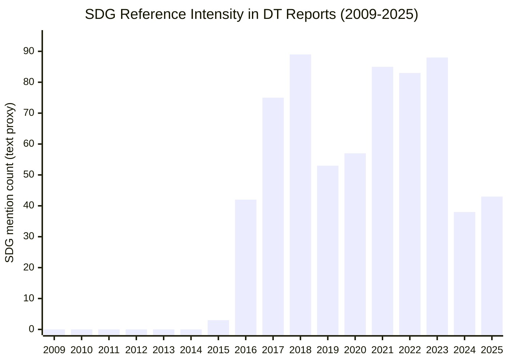
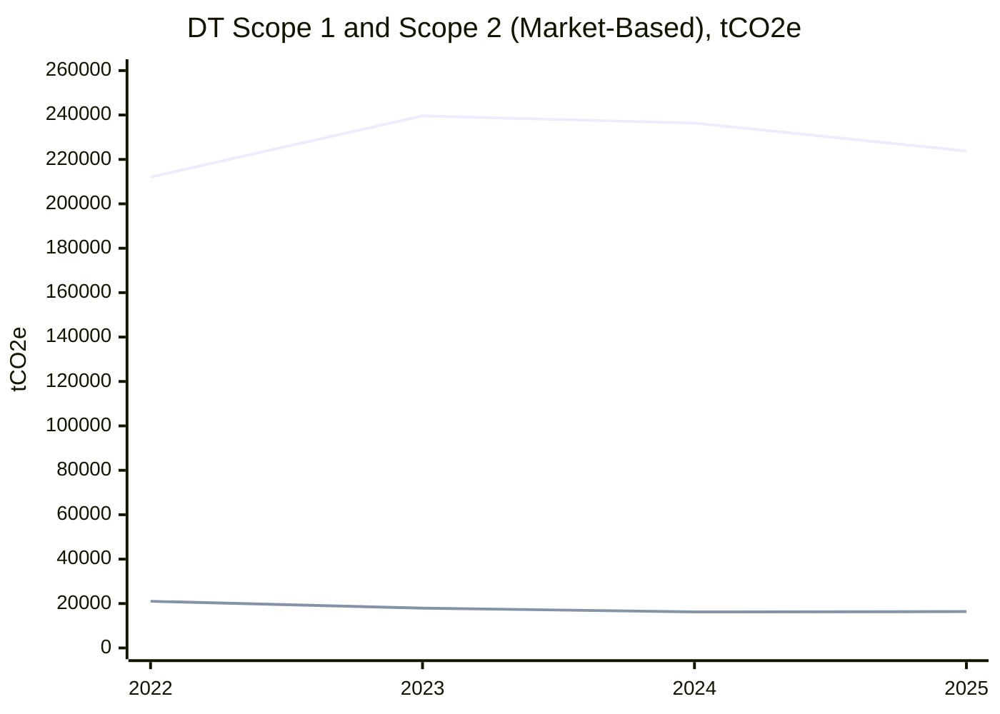

# Deutsche Telekom Sustainability Strategy Analysis

## Executive Summary
Deutsche Telekom (DT) has developed a relatively mature sustainability strategy compared with many telecom peers, with strong governance integration, board-level oversight, and clear climate milestones. The company reports net zero for own operations (Scope 1 and Scope 2) in 2025 through deep reductions plus neutralization of residual emissions, while maintaining medium-term and long-term ambitions across the value chain.

The central strategic issue is now execution quality in Scope 3. DT has moved beyond basic disclosure and compliance. The next value-creation frontier is translating sustainability data into capital allocation, supplier transformation, circularity economics, and differentiated customer offerings.

This report applies course tools (double materiality, KPI quality, implementation logic) to assess DT's current strategy and propose practical recommendations.

## Company Profile (Detailed Introduction)
Deutsche Telekom AG is a multinational telecommunications group headquartered in Bonn, Germany (founded in 1995), operating primarily through the segments Germany, USA, Europe, and Systems Solutions.

Key profile elements used for this case:
- Legal and reporting scope: 326 fully consolidated companies (CR report scope).
- Commercial scale: 298 million total connections and around 245,000 petabytes of annual network data traffic (GSMA indicators in CR reporting).
- Workforce scale: approximately 199,000 employees in 2025 (external public market profile based on Annual Report references); historical CR reporting also shows a structurally international workforce mix (about 61 percent international vs 39 percent domestic in the 2021 CR workforce profile).
- Geographic footprint: worldwide operations, with business concentration in Germany, the United States, and European national companies.
- Financial and operating structure: the four operating segments represent about 99 percent of Group sales in ESG KPI governance.

Strategic implication for this assignment:
The size and geographic spread of DT mean that sustainability execution is a complex portfolio management problem across infrastructure, supply chains, and service ecosystems, not a single-country compliance exercise.

## 1. Company Context and Industry Dynamics
DT operates in a capital-intensive telecom industry with high energy demand, long-lived network assets, and increasing dependence on digital trust factors (cybersecurity, privacy, and resilience). Sustainability is therefore directly linked to cost structure, risk profile, and competitive positioning, not only reputation.

Relevant competitive pressure comes from large European operators (for regulatory and operating benchmarks) and global digital ecosystem players (for technology pace and value capture). At the same time, the external context has shifted decisively:
- reporting obligations under CSRD/ESRS in Europe,
- stronger scrutiny from investors, enterprise customers, and regulators,
- climate transition and physical-risk exposure affecting infrastructure economics,
- rising pressure to prove business-case ESG, not narrative ESG.

In this environment, the strategic test is whether DT can convert sustainability management capability into durable economic advantage.

## 2. Assessment of DT's Current Sustainability Strategy
### 2.1 Main strengths
1. Strategic integration
DT frames sustainability as part of core business strategy (environment, social, governance) rather than a peripheral CSR layer.

2. Governance and accountability
Climate and ESG indicators are integrated into management steering and incentive systems, supporting execution discipline.

3. Reporting maturity
DT discloses according to advanced frameworks and links reporting to internal controls, improving comparability and credibility.

4. Clear ambition architecture
Milestones are explicit:
- net zero in own operations (Scope 1 and 2) in 2025,
- 55 percent reduction across Scopes 1-3 by 2030 vs 2020,
- net zero value chain by 2040 with at least 90 percent reduction and limited neutralization.

### 2.2 Main strategic gaps
1. Scope 3 transformation depth
The largest emissions and system-wide dependencies sit in supply chain and product/use-phase dynamics.

2. KPI-to-decision gap
A broad KPI set does not automatically improve strategic choices unless linked to investment, pricing, procurement, and portfolio decisions.

3. Circularity execution risk
Targets are ambitious, but operational scaling requires stronger economics by segment and ecosystem alignment.

4. Multi-market implementation complexity
Global standards need stronger local operating playbooks to avoid uneven execution.

## 3. Emissions and SDG Evolution: Historical Perspective
### 3.1 Coverage across reports (2009-2025)
A review of available DT reports in this repository shows sustained presence of Scope 1/2/3 disclosure language over time, with stronger methodological depth in recent years. SDG references become visible and then materially stronger after 2015, consistent with broader corporate alignment to the UN SDG agenda.

Interpretation: this is a disclosure-intensity proxy, not an impact-performance score by SDG.

### 3.1A SDGs touched and actions by date (action-based view)
The following table consolidates concrete actions and links them to SDGs by year, with short operational descriptions.

| SDG | Date | Action executed | Practical effect |
|---|---|---|---|
| SDG 2 (Zero Hunger) | 2022 | Real-time precision-agriculture positioning solution via 5G for farmers | More precise machinery use, optimized fertilizer/seeds dosing, yield support, lower emissions |
| SDG 3 (Good Health and Well-being) | 2022 | AR FieldAdvisor and mobility solutions reducing transport-related pollution | Better urban air quality and lower health-related externalities |
| SDG 4 (Quality Education) | 2022 | Teachtoday multimedia learning and AwareNessi cyber-literacy content for children and parents | Higher media literacy and safer digital behavior |
| SDG 5 (Gender Equality) | 2022 | Gender-neutral educational avatar/language in AwareNessi content | Inclusive digital education and representation practices |
| SDG 6 (Clean Water and Sanitation) | 2022 | Sustainable product packaging using soy-based inks | Reduced use of environmentally harmful chemicals |
| SDG 7 (Affordable and Clean Energy) | 2021 | Group-wide sourcing of 100 percent renewable electricity | Decarbonization of purchased electricity and lower Scope 2 market-based footprint |
| SDG 8 (Decent Work and Economic Growth) | 2022 | Productivity gains from remote service models (AR FieldAdvisor) and digital process efficiency | Higher service productivity, time savings, and improved employee work conditions |
| SDG 9 (Industry, Innovation and Infrastructure) | 2022 | Device-as-a-Service and digital service tools in field/customer operations | More resource-efficient device lifecycle management and digital process innovation |
| SDG 10 (Reduced Inequalities) | 2022 | Inclusive and multilingual educational content accessibility (AwareNessi) | Broader inclusion across user groups and languages |
| SDG 11 (Sustainable Cities and Communities) | 2022-2025 | Remote maintenance, airport-collaboration solutions, and digital-society access programs | Reduced transport emissions and expanded digital participation (40 million people reached in 2025) |
| SDG 12 (Responsible Consumption and Production) | 2022 | Device-as-a-Service with >97 percent refurbishment rate and lifecycle extension | Lower material throughput and reduced lifecycle emissions |
| SDG 13 (Climate Action) | 2025 | Net zero in own operations (Scope 1 and 2) after >94 percent reduction vs 2017 plus residual neutralization | Strong operational climate milestone and transition credibility |
| SDG 15 (Life on Land) | 2025 | High-quality removal projects including reforestation for residual emissions neutralization | Land-based carbon sequestration support and ecosystem co-benefits |
| SDG 16 (Peace, Justice and Strong Institutions) | 2022 | Digital safety/ethics education and human-rights process strengthening | Improved responsible behavior in digital spaces and governance maturity |
| SDG 17 (Partnerships for the Goals) | 2022-2023 | Partnerships (e.g., everphone, A-CDM ecosystem coordination, multi-stakeholder collaborations) | Faster scale-up of sustainability solutions through ecosystem cooperation |

Additional SDG governance evidence in reporting:
- 2023 CR program explicitly focuses on SDGs 2, 3, 4, 5, 7, 8, 9, 11, 12, 13, 15, 16.
- DT reports structured "Measures and KPIs relevant to SDGs" in CR documentation.

### 3.2 Verified annual emissions values (most robust years)
The most reliable absolute values available in extractable form are recent years.

| Metric (tCO2e) | 2022 | 2023 | 2024 | 2025 |
|---|---:|---:|---:|---:|
| Scope 1 | 212,044 | 239,602 | 236,355 | 223,790 |
| Scope 2 (market-based) | 21,019 | 17,957 | 16,212 | 16,375 |
| Scope 2 (location-based) | 4,232,913 | 3,979,565 | 4,002,218 | 3,736,800 |

### 3.3 Scope 3 trajectory
Full annual absolute Scope 3 values are not consistently available in machine-extractable format across the entire historical period. However, DT discloses progress against baseline and targets:
- approximately 10.7 percent Scope 3 savings by 2024 vs base,
- approximately 26.6 percent Scope 3 savings by 2025 vs base,
- 55 percent reduction target across Scopes 1-3 by 2030 vs 2020.

This confirms progress while also showing that Scope 3 remains the decisive implementation challenge.

## 4. Application of Course Tools
### 4.1 Double materiality
Impact materiality (inside-out): emissions, circularity, digital inclusion, supply-chain social/environmental effects.
Financial materiality (outside-in): energy costs, transition regulation, resilience risk, stakeholder demand shifts.

Strategic implication: priorities should be selected with a value-at-stake lens combining materiality, controllability, and economic relevance.

### 4.2 KPI quality: hindsight, insight, foresight
- Hindsight: absolute emissions, intensity metrics, circularity outcomes.
- Insight: operational drivers by network segment, supplier performance, conversion rates.
- Foresight: trajectory probability to 2030/2040, transition capex alignment, risk-adjusted scenario metrics.

The current opportunity for DT is to shift from report-centric KPIs to decision-centric KPI architecture.

## 5. Recommendations
1. Make Scope 3 a growth and margin lever
Integrate supplier decarbonization with commercial strategy, especially in enterprise offers where customers need verified emissions reduction pathways.

2. Build an integrated Transition Control Tower
Combine ESG, finance, and risk metrics in one steering model to improve capital-allocation speed and quality.

3. Redesign incentive weighting toward forward-looking execution
Preserve historical metrics but increase weight on transition milestones, supplier progress, and measurable implementation quality.

4. Scale circularity with explicit unit economics
Track collection cost, refurbish yield, residual value, and customer adoption by product category.

5. Institutionalize climate resilience in network planning
Embed physical-risk adaptation standards in infrastructure investment decisions.

6. Apply global standards with local execution playbooks
Keep one auditable group framework while allowing local adaptation in implementation mechanisms.

## 6. Implementation Roadmap
### 0-6 months
- Re-prioritize material issues by value-at-stake.
- Finalize KPI architecture (hindsight/insight/foresight).
- Launch supplier transformation pilots on highest-emission categories.

### 6-18 months
- Deploy integrated control-tower governance in priority segments.
- Introduce stronger forward-looking KPIs in variable compensation.
- Scale customer-facing low-carbon digital solutions with measurable outcomes.

### 18-36 months
- Industrialize circularity economics across network and device categories.
- Integrate climate adaptation standards into major capex gates.
- Publish auditable ESG-to-business performance linkage dashboard.

## Conclusion
DT has already achieved a high level of sustainability strategy maturity in governance, disclosure, and target-setting. The next strategic step is to turn this maturity into superior economic performance through deeper Scope 3 execution, stronger decision-grade KPI architecture, and tighter integration between sustainability levers and business model outcomes.

In short, DT's challenge is no longer whether sustainability is integrated. The challenge is whether it is operationalized fast enough to become a durable competitive advantage.

## Sources (from provided repository)
- Sustainability Strategy syllabus and course handouts
- Deutsche Telekom CR Reports (historical set in repository)
- Deutsche Telekom CR Report 2024
- Deutsche Telekom CR Report 2025
